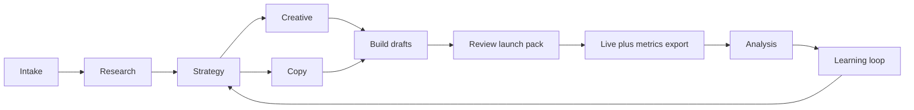

# Meta Ads Agent

**The public reference implementation of my staged-skill approach to Meta paid social:** research, ship many variants, kill losers, scale winners, and log what worked for the next flight. Every step ends with a human approval. API payloads are drafts only, so nothing goes live from this repo.

Run it end to end in Cursor and you get a chain of files you can diff and review, not a chain of chats. This project is part of my [agent portfolio](https://github.com/loganriebel). Walk through [`demo-campaign`](examples/demo-campaign/) for a full fictional example from intake to learnings, or read [docs/ARCHITECTURE.md](docs/ARCHITECTURE.md) for how the production version is built.

---

## Why teams get stuck on Meta

You have probably seen this pattern:

- Not enough creative or copy variants to find winners before the budget is gone.
- Last quarter’s learnings sit in one person’s Ads Manager, not in a shared doc.
- Launches skip research, policy review, or written kill/scale rules.
- AI gets used for one-off copy, then the thread disappears.

I built this pipeline so a campaign is a chain of files, not a chain of chats. Stage two reads stage one. A new marketer or a new session can pick up `strategy/q2-trial.md` without re-briefing a model from scratch.

---

## What an org gets from running it

**More tests, less randomness.** Intake, research, and strategy produce a testing matrix: hypotheses, ad set structure, and variants on purpose, not because someone had an hour and a ChatGPT tab open.

**Less budget on obvious losers.** Kill and scale rules live in config (CPA, ROAS, minimum spend). The performance stage turns an Ads Manager export into a prune/scale memo with reasons, not vibes.

**Memory that survives headcount changes.** The `learnings/` folder stores hooks, angles, and audiences that worked, plus what failed, tagged with campaign slug and numbers. The next strategy stage is supposed to read it.

**Safer launches.** Brand voice and policy checks run before build. API payloads are drafts only; I launch in Meta after sign-off on the QA pack.

**Readable work for people who do not live in Cursor.** PMs, founders, and legal can read intake briefs, strategy docs, and launch checklists. The work lives in git, not in a private chat log.

**A senior marketer can run the gates; others can execute.** Coordinators or juniors can follow stage artifacts and checklists while I own strategy and approvals.

### Where it fits best

- B2B SaaS free trial or demo campaigns (pain-led hooks, product UI, lead gen).
- New offer or geo launches (competitor and Ad Library research before spend).
- Structured creative tests (creative stage vs copy stage, so you know what you changed).
- Account turnarounds (import CSV, document pause/scale decisions, update learnings).
- Client or internal sign-off (QA pack + draft payloads before publish).

---

## How I use AI here

I still own the calls.

I approve every stage before the next runs. ICP, offer, compliance, and proof sit in `AGENTS.md` and brand rules so the agent does not invent positioning. Performance recommendations use real exports from Ads Manager and thresholds I set in config. I create and pause campaigns in Meta; this repo does not call the Marketing API or move live budget.

AI is good at volume: research synthesis, copy variants, consistent naming, checking copy against the brief. I am good at judgment: which angles get budget, when to kill, brand taste, reading whether creative is actually strong. The split is intentional.

---

## How it works

Nine small skills, not one giant prompt. Each skill does one job and writes one artifact. A router skill (`meta-ads.md`) figures out which stage you are on from files on disk.

| Stage | What I get out of it |
|-------|----------------------|
| 1. Intake | Campaign brief tied to offer, budget, tracking, constraints |
| 2. Research | Angles backed by audience pain and competitor patterns |
| 3. Strategy | Test plan, ad set map, kill/scale rules finance can read |
| 4. Creative | Production briefs (static, video, UGC direction) |
| 5. Copy | Primary text, headlines, CTAs, UTMs per variant |
| 6. Build drafts | Campaign YAML plus draft API JSON (paused) |
| 7. Review launch pack | Validation, policy pass, human sign-off list |
| 8. Performance analysis | Winner/loser/hold and budget notes from CSV |
| 9. Learning loop | Updated hooks/angles/audiences for the next flight |

### Example deliverables (`demo-campaign`)

Fictional B2B SaaS trial, end to end:

- [Intake](intake/demo-campaign.md): goals and guardrails
- [Strategy](strategy/demo-campaign.md): structure and decision rules
- [Copy](copy/demo-campaign.md): variants with UTMs
- [Campaign draft](campaign-drafts/demo-campaign.yaml): build file for tooling
- [API payloads](api-payloads/demo-campaign/): draft JSON, human review required
- [Analysis](analysis/demo-campaign.md): scale and pause recommendations
- [Learnings](learnings/hooks.md): what to run again

That is the model: markdown and YAML you can diff, review, and hand off.

---

## Trust and guardrails

Draft-only API mode. No unattended spend changes from this repository. Budget caps and max scale percentage live in `meta-ads-config.yaml`. Safety rules in `.cursor/rules/meta-ads-safety.mdc`. The QA launch pack has an explicit sign-off line before go-live.

I built it for teams where marketing, finance, and legal all want to see why a campaign looks the way it does.

---

## Under the hood

| Piece | Role |
|-------|------|
| `.cursor/skills/` | Stage playbooks |
| `.cursor/rules/` | Voice, first-run gate, safety |
| `meta_ads_tools/` | Validate artifacts, build payload drafts, analyze metrics CSV |
| `AGENTS.md`, `CLAUDE.md` | Business context and campaign inventory |

Python 3.10+ is optional for the validators. You can run the process by hand and still keep the same file structure.

---

## Where this went next

This repo is the readable version of the idea. The production agent runs on Claude Code skills, and four things changed on the way there:

- The creative stage renders finished images through fal.ai against brand fixtures, instead of handing a production brief to a designer.
- Ad-policy screening became its own stage. No creative reaches publish without passing it.
- Every Meta write goes through a proxy that holds the access token, allowlists what can be created, forces a paused state, rejects anything trying to go active, and caps ad-set budget. Turning that off takes a human editing the proxy, which is the friction I want on that decision.
- Performance classifications write back to a patterns file that briefs the next sprint, so each run starts from the last one's data.

[docs/ARCHITECTURE.md](docs/ARCHITECTURE.md) covers the stage map, the proxy, and the pruning rules.

**Try it:** the [Meta Ads Agent demo](https://makometrics.com/meta-ads-agent) runs the research and creative stages on any brand. Enter a site and it researches the brand, drafts seven ad concepts, and renders up to five Meta-style creatives. Nothing publishes to Meta.

The production repo is private while I work through the live-spend gates. This one stays public as the reference.

---

## Also in the portfolio

Same staged-skill idea as my [seo-content-stack](https://github.com/loganriebel/seo-content-stack) repo (organic content). This one is Meta paid social only.

To run it yourself: [SETUP.md](SETUP.md), then ask Cursor to start a new Meta campaign via the **meta-ads** router.

Interested in doing this for your business or looking to add powerful AI GTM flows? Email me at loganriebel@gmail.com or connect with me at https://www.linkedin.com/in/logan-riebel/
